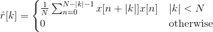

# Bartlett Autocorrelation Function Estimator

Quite fast Matlab mex Bartlett autocorrelation function estimator written in C++.

## Why

I wanted to write the fastest Bartlett ACF estimator in existence. Just for fun. On my old laptop and compared to the fastest Matlab Bartlett estimator I could write, it's about 30 times faster for 64-bit doubles, and about 50 times faster for 32-bit singles (floats).

# Definition



## How

It uses vectorization and parallelization (threading) to achieve these reults.

## Installing

Install Agner Fog's [vectorclass](https://github.com/vectorclass) library. It's a header-only library, so just extract/clone it into the project base directory.
```
git clone https://github.com/vectorclass/version2.git
```
In matlab, compile this into mex with
```
mex CXXFLAGS='$CXXFLAGS -std=c++1z -O3 -march=native -Wall -Wextra
```
This ensures it compiles with high optimizations and vector instructions if available.

## Running the tests and benchmarks

In Matlab, go to the project directory. Run *test.m*. It will both check for errors and run benchmarks.

## Caveats

For short vectors, the simple single-threaded method is faster.

## Example

After compiling successfully, in Matlab, run
```
acf_est([1; 2; 3; 4])
```
to estimate. Write
```
help acf_est
```
for more details about command parameters and specifics.

## Built With

* [vectorclass](https://github.com/vectorclass/version2) - Vectorization library

## Authors

* **Emil Berg** - [ember91](https://github.com/ember91)

## License

This project is licensed under the MIT License - see the [LICENSE.md](LICENSE.txt) file for details
